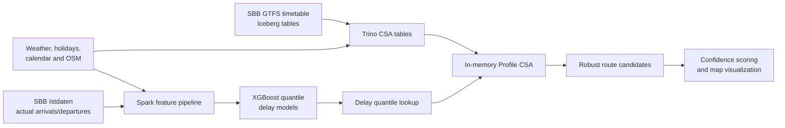
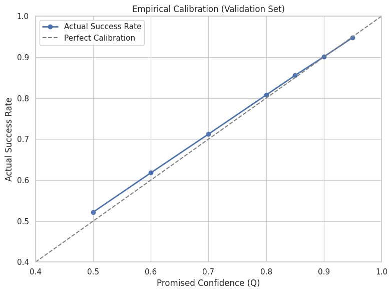
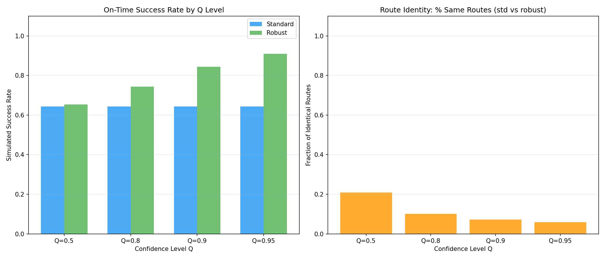

# Robust Journey Planner

Robust Journey Planner is a confidence-aware public transport routing engine for Switzerland. Given an origin, destination, arrival deadline, and target reliability level, it finds the latest route that can still arrive on time with that probability.

A normal timetable planner asks: "Which route is scheduled to arrive first?" This project asks a harder and more realistic question: "Which route is still likely to work when trains, buses, and transfers are delayed?" To answer that, the system combines Swiss-scale SBB timetable data, historical SBB Istdaten actual-arrival records, OpenStreetMap walking paths, and learned delay distributions.

## Project Context

Built for EPFL COM-490 **Large-Scale Data Science for Real-World Data**.

Team J1:

- Jon Kuçi
- Vasileios Gkikas
- João Pinto
- Yahya Skalli
- Nicolas Karmolinski

## Technology Stack

| Area | Tools |
|---|---|
| Distributed data processing | Hadoop/HDFS, Apache Spark, PySpark, Iceberg tables, Trino |
| Machine learning | SparkXGBRegressor, XGBoost quantile regression, pinball loss, Spark ML pipelines |
| Routing and geospatial | Profile CSA, OpenStreetMap, Sedona, KD-trees, Dijkstra shortest paths |
| Analysis and visualization | Jupyter, pandas, NumPy, Folium, Matplotlib |

The project was developed for a compute-cluster environment because the workload is genuinely large: historical SBB actual-time data, weather and calendar joins, geospatial preprocessing, and a nationwide timetable with roughly **14 million connections**.

## The Idea

Public transport reliability is often decided at transfers. A route can look perfect on the timetable, but if one leg has a high delay risk and the next connection leaves two minutes later, the route is fragile.

This planner treats every route as a chain of probabilistic events. For each ride leg, it estimates the probability that the vehicle arrives early enough to make the next transfer or final deadline. The full route confidence is then computed across all legs, and only routes above the requested threshold are returned.

That means the output is not just a fast route. It is a route that is fast **and** statistically likely to succeed.

## Architecture

The expensive work happens before routing: Spark prepares delay features, Trino prepares timetable tables, OSM walking transfers are materialized, and XGBoost models are stored as artifacts. At query time, the planner runs from compact in-memory arrays with no database calls in the scan loop.

## Routing Engine

The core planner in [`src/routing/robust_journey_planner.py`](src/routing/robust_journey_planner.py) is based on the **Connection Scan Algorithm (CSA)** family, a state-of-the-art approach for timetable routing introduced by Dibbelt, Pajor, Strasser, and Wagner.

This project uses a backward **Profile CSA**. Starting from the arrival deadline, it scans timetable connections in reverse and builds a Pareto profile at each stop: latest possible departures, earliest arrivals, and the route pointer needed to reconstruct the journey.

The important twist is that confidence is not bolted on after routing. It is baked into the scan:

- each transfer receives a probability from the learned delay quantiles;
- route confidence is accumulated in log-space for numerical stability;
- labels below the requested confidence are never inserted into the stop profiles;
- early stopping avoids scanning once the best robust routes are already guaranteed.

Walking transfers are also more realistic than a straight-line radius. The project uses OpenStreetMap walking paths, maps stops onto the network, and computes shortest walking transfers with Dijkstra.

## Large-Scale Delay Prediction

The delay model predicts **arrival-delay quantiles** for a vehicle reaching a stop under a specific context: line, stop, hour, day type, calendar conditions, weather, and historical delay patterns. These predictions answer questions like:

> For this train arriving at this stop around this time, how many seconds of delay should we expect at the 90th percentile?

The training pipeline in [`src/models/delay_model_trainer.py`](src/models/delay_model_trainer.py) uses SparkXGBRegressor to train seven XGBoost quantile models:

`Q = {0.50, 0.60, 0.70, 0.80, 0.85, 0.90, 0.95}`

The models were trained on a stratified sample of the historical SBB Istdaten corpus, with the final setup using data from **October 2024 to July 2025**. Features include stop and line identity, hour/day/month, historical delay aggregates, public-holiday flags, bridge-day indicators, and weather features such as temperature, humidity, dew point, and UV index.

At routing time, these quantiles become a lightweight delay distribution. If a route has a 5-minute transfer, the planner estimates the probability that the incoming vehicle delay stays below that headway. This is the ML component that turns a timetable route into a reliability-aware route.

## Scale And Performance

| Scope | Connections | Search window | Average query | P95 query |
|---|---:|---:|---:|---:|
| Lausanne + outer Lausanne | ~620k | 2 hours | ~58 ms | ~137 ms |
| Switzerland | ~14M | ~6.6 hours | ~3.8 s | ~13.1 s |

The nationwide version keeps the Swiss timetable in memory and performs confidence-aware routing directly over the connection arrays. The result is a planner that can reason about reliability at country scale while still answering interactive queries.

## Validation

The planner was evaluated from both a statistical and end-to-end perspective:

- **Statistical calibration:** 200k historical samples preserving delay distributions, used to check whether requested confidence levels match empirical success rates.
- **Real-journey stress testing:** about 6,700 historical journeys across 9 complex days, including rush hours, holidays, tight transfers, 0-3 transfers, and variable deadline buffers.

  
  

One illustrative scenario was **Lugano to Basel SBB** with an 18:00 target arrival. The robust planner selected a later route that remained reliable after forecasting a high-risk delayed leg, avoiding the overly conservative behavior of simply leaving much earlier.

## Repository Guide

| Path | Purpose |
|---|---|
| [`src/routing/`](src/routing) | Profile CSA planner, confidence-aware routing, and route reconstruction |
| [`src/models/`](src/models) | XGBoost quantile delay models, training, inference, and updater lifecycle |
| [`src/data/`](src/data) | Timetable, Istdaten, weather, calendar, and OSM footpath preparation |
| [`src/evaluation/`](src/evaluation) | Calibration, real-journey extraction, and end-to-end evaluation |
| [`src/viz/`](src/viz) | Route maps and evaluation plotting helpers |
| [`results/`](results) | Evaluation scripts, notebooks, flowcharts, and generated figures |
| [`main.ipynb`](main.ipynb) | Main notebook to check for the end-to-end project workflow and demonstration |
| [`map_visualize.ipynb`](map_visualize.ipynb) | Interactive map-based route visualization |
| [`model_updater.ipynb`](model_updater.ipynb) | Model refresh and maintenance workflow |

## Reproducibility Note

The repository includes notebooks, source code, local artifacts, and generated figures for inspection. Full reproduction expects access to the EPFL COM-490 cluster environment, including Hadoop/HDFS, Iceberg datasets, Trino credentials, Spark, and the historical SBB/weather tables.

## References

- Julian Dibbelt, Thomas Pajor, Ben Strasser, Dorothea Wagner. [Connection Scan Algorithm](https://arxiv.org/abs/1703.05997), 2017.
- The implementation uses the paper's profile-query framing and adapts the CSA scan for confidence-aware routing under learned delay uncertainty.