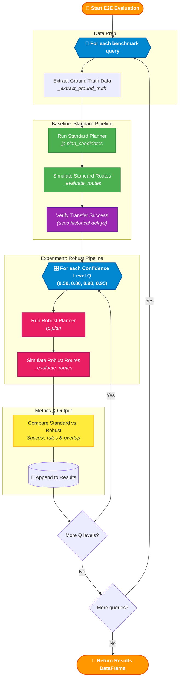

# End-to-End Evaluator Execution Flow

```mermaid
flowchart TD
    %% Define Presentation Styles
    classDef startEnd fill:#FF9800,stroke:#E65100,stroke-width:2px,color:#fff,font-weight:bold;
    classDef loop fill:#0288D1,stroke:#01579B,stroke-width:2px,color:#fff,font-weight:bold;
    classDef standard fill:#4CAF50,stroke:#2E7D32,stroke-width:2px,color:#fff;
    classDef robust fill:#E91E63,stroke:#AD1457,stroke-width:2px,color:#fff;
    classDef eval fill:#9C27B0,stroke:#6A1B9A,stroke-width:2px,color:#fff;
    classDef metric fill:#FFEB3B,stroke:#FBC02D,stroke-width:2px,color:#333;

    %% Main Entry
    Start(["🚀 Start E2E Evaluation"]):::startEnd --> Loop{{"🔄 For each benchmark query"}}:::loop
    
    subgraph DataPrep ["Data Prep"]
        Loop --> ExtGT["Extract Ground Truth Data<br><i>_extract_ground_truth</i>"]
    end

    subgraph Baseline ["Baseline: Standard Pipeline"]
        ExtGT --> StdPlan["Run Standard Planner<br><i>jp.plan_candidates</i>"]:::standard
        StdPlan --> EvalStd["Simulate Standard Routes<br><i>_evaluate_routes</i>"]:::standard
        EvalStd --> EvalLogic["Verify Transfer Success<br><i>(uses historical delays)</i>"]:::eval
    end

    subgraph Experiment ["Experiment: Robust Pipeline"]
        EvalLogic --> QLoop{{"🎛️ For each Confidence Level Q<br>(0.50, 0.80, 0.90, 0.95)"}}:::loop
        QLoop --> RobPlan["Run Robust Planner<br><i>rp.plan</i>"]:::robust
        RobPlan --> EvalRob["Simulate Robust Routes<br><i>_evaluate_routes</i>"]:::robust
    end

    subgraph MetricsOutput ["Metrics & Output"]
        EvalRob --> Compare["Compare Standard vs. Robust<br><i>Success rates & overlap</i>"]:::metric
        Compare --> Store[("💾 Append to Results")]
    end

    %% Looping logic
    Store --> NextQ{"More Q levels?"}
    NextQ -- Yes --> QLoop
    NextQ -- No --> NextRow{"More queries?"}

    NextRow -- Yes --> Loop
    NextRow -- No --> End(["🏁 Return Results DataFrame"]):::startEnd
```
