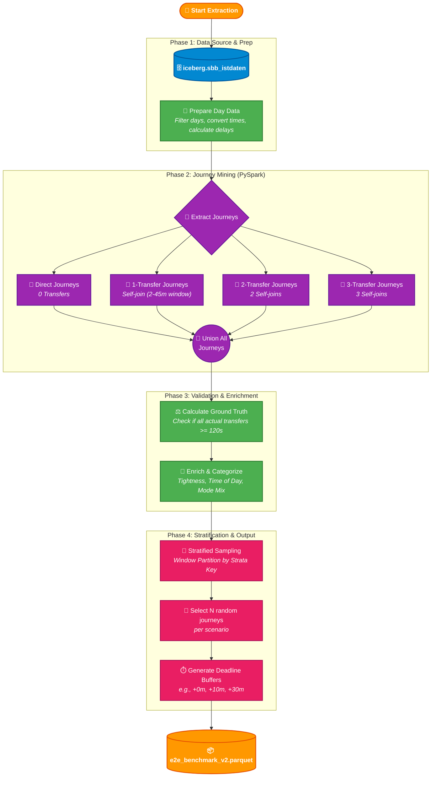

# Journey Extractor Flowchart

```mermaid
flowchart TD
    %% Define Presentation Styles
    classDef startEnd fill:#FF9800,stroke:#E65100,stroke-width:2px,color:#fff,font-weight:bold;
    classDef database fill:#0288D1,stroke:#01579B,stroke-width:2px,color:#fff,font-weight:bold;
    classDef process fill:#4CAF50,stroke:#2E7D32,stroke-width:2px,color:#fff;
    classDef mining fill:#9C27B0,stroke:#6A1B9A,stroke-width:2px,color:#fff;
    classDef sample fill:#E91E63,stroke:#AD1457,stroke-width:2px,color:#fff;

    Start(["🚀 Start Extraction"]):::startEnd --> DB[("🗄️ iceberg.sbb_istdaten")]:::database

    subgraph Phase1 ["Phase 1: Data Source & Prep"]
        DB --> Prep["🧹 Prepare Day Data<br><i>Filter days, convert times, calculate delays</i>"]:::process
    end

    subgraph Phase2 ["Phase 2: Journey Mining (PySpark)"]
        Prep --> Split{"🔀 Extract Journeys"}:::mining
        
        Split --> D0["🚆 Direct Journeys<br><i>0 Transfers</i>"]:::mining
        Split --> D1["🚆 1-Transfer Journeys<br><i>Self-join (2-45m window)</i>"]:::mining
        Split --> D2["🚆 2-Transfer Journeys<br><i>2 Self-joins</i>"]:::mining
        Split --> D3["🚆 3-Transfer Journeys<br><i>3 Self-joins</i>"]:::mining
        
        D0 --> Merge
        D1 --> Merge
        D2 --> Merge
        D3 --> Merge
        
        Merge(("🔗 Union All<br>Journeys")):::mining
    end

    subgraph Phase3 ["Phase 3: Validation & Enrichment"]
        Merge --> CalcGT["⚖️ Calculate Ground Truth<br><i>Check if all actual transfers >= 120s</i>"]:::process
        CalcGT --> Enrich["🧠 Enrich & Categorize<br><i>Tightness, Time of Day, Mode Mix</i>"]:::process
    end

    subgraph Phase4 ["Phase 4: Stratification & Output"]
        Enrich --> Stratify["🎯 Stratified Sampling<br><i>Window Partition by Strata Key</i>"]:::sample
        Stratify --> Sample["🎲 Select N random journeys<br><i>per scenario</i>"]:::sample
        Sample --> Buffers["⏱️ Generate Deadline Buffers<br><i>e.g., +0m, +10m, +30m</i>"]:::sample
    end
    
    Buffers --> Output[("📦 e2e_benchmark_v2.parquet")]:::startEnd
```
