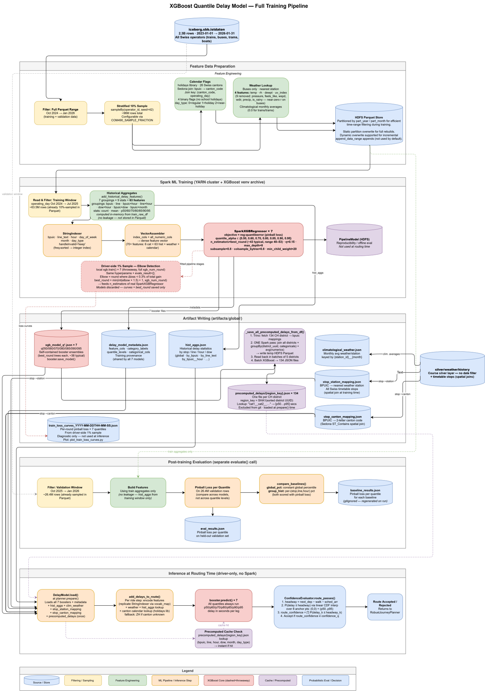

# Delay Model

We train **7 XGBoost models**, each with a different `quantile_alpha`:

```
quantile_levels = [0.50, 0.60, 0.70, 0.80, 0.85, 0.90, 0.95]
```

Each model uses `objective="reg:quantileerror"` (pinball loss).
Minimizing it forces the model to find the value `t` such that `q * 100%` of actual delays fall below `t`:

- q=0.50 → median delay
- q=0.90 → only 10% of real delays exceed this value
- q=0.95 → only 5% of real delays exceed this value

All 7 models see the **same rich feature set** (stop, line, hour, day, month, weather for buses, calendar flags, historical aggregates) and learn a different slice of the delay distribution.

High-level architecture diagram:



Model training and inference code:

- `models/delay_model_trainer.py` — Spark training pipeline
- `models/delay_model.py` — inference-time model loading and delay annotation
- `models/model_artifacts.py` — artifact path management
